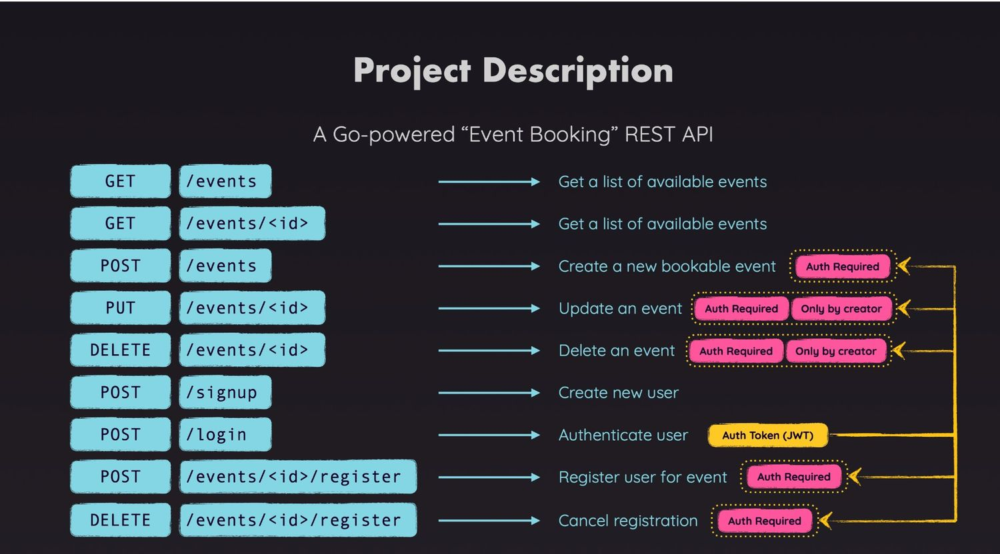

Output:




## Tech Stack:
- Backend: Golang +Gin Framework
- Database: sqlite
- Frontend: React (upcomming...)

## Features: 
- Basic CRUD
- Hash Password
- JWT Authentication
- Input Validation
- MVC 
- Authorization User
- Middleware Interation

Basic: 

- If err == nil, it means: "everything went fine"
- If err != nil, it means: "something went wrong", and you can check err.Error() to see what happened.
- So, nil is just Go’s way of saying “there was no error.” You check for non-nil to handle problems.


```shell
Event-Booking-app/
│
├── routes/             `[working on routes]`
│   └── item-routes.go
│
├── controllers/ `[working on request and response]`
│   └── item-controller.go 
│
├── models/            `[working on type struct and interface]`
│   └── item-model.go
│
├── services/        `[working on database query]`
│   └── item-services.go
│
├── config/
│   └── db.go
│
├── main.go
│
└── go.mod


```


## All Install Packages:

-  `go mod init bappa.com/rest`
-  `go get -u github.com/gin-gonic/gin`
-  `go get github.com/mattn/go-sqlite3`
- `go get github.com/fatih/color`  for color the console
- `go install github.com/gravityblast/fresh@latest` for auto restart
- `go get golang.org/x/crypto` bcrypt for hash password
- `go get -u github.com/golang-jwt/jwt/v5` JWT


## Run the server

-` go run .` ||  `go run main.go` || `fresh`
- `fresh` for auto restart 


### Steps:

✅  **Events**:

- [X] 01-project initialized with server and gin framework 

-  `go mod init bappa.com/rest`
-  `go get -u github.com/gin-gonic/gin`

- [X] 02-Add and Test Create and Get event 


- [X]03-Initilazation of SQL Database 

 -`https://github.com/mattn/go-sqlite3`
    - `go get github.com/mattn/go-sqlite3`


🔋 Database Connection Part

```go
var DB *sql.DB
 
func InitDB() {
    var err error
    DB, err = sql.Open("sqlite3", "api.db")
 
    if err != nil {
        panic("Could not connect to database.")
    }
 
    DB.SetMaxOpenConns(10)
    DB.SetMaxIdleConns(5)
 
    createTables()
}
```
- [X] 04-Insert & Read Data from Database

Preparing Statements vs Directly Executing Queries `(Prepare() vs Exec()/Query())`

We started sending SQL commands to the SQLite database.

And we did this by following different approaches:

- DB.Exec() (when we created the tables)

- Prepare() + stmt.Exec() (when we inserted data into the database)

- DB.Query() (when we fetched data from the database)

Using Prepare() is 100% optional! You could send all your commands directly via Exec() or Query().

The difference between those two methods then just is 

- whether you're fetching data from the database `(=> use Query())` or your manipulating the database / data in the database `(=> use Exec()).`

But what's the advantage of using `Prepare()?`

Prepare() prepares a SQL statement - this can lead to better performance if the same statement is executed multiple times (potentially with different data for its placeholders).

This is only true, if the prepared statement is not closed (stmt.Close()) in between those executions. In that case, there wouldn't be any advantages.

And, indeed, in this application, we are calling stmt.Close() directly after calling stmt.Exec(). So here, it really wouldn't matter which approach you're using.

💡 But in order to show you the different ways of using the sql package,I decided to also include this preparation approach in this project 


- [X]  05-Beautify console and json data 🔆

- `go get github.com/fatih/color`

- use like this

import ("github.com/fatih/color")

color.Cyan("🔋 🚀 Server running at http://localhost:8080")

- [X] 06-Add git ignore files

- [X] 07-update readme

- [X]08-Get event by Id done

- [X]09-Refctoring code and route for scalability and maintalibility

- [X] 10-Update route added

--- 

✅  **Users: 13-Commit**

- [X] Create routes for the users.
- [X] First create the users table and make a connection with events table.
- [X] Write the route, controller,service,model for signup user.
- [X] 14. Create Hash Password signup user.
    - https://pkg.go.dev/golang.org/x/crypto/bcrypt
    - `go get golang.org/x/crypto`
- [X] 15. valided user with finished the login functionality
- [X] 16. Generate JWT
- [X] 17. Adding Token Varification [complex part]


✅ **Middleware : 20-Commit :**

- [X] 18. Now implement route protection
- [X] 19. Retrieving & Storing User and Event IDs
- [X] 22. Adding Authorization To Restrict Users From Editing & Deleting


✅ **Registration Route : 23-Commit :**

- [X] 23. Registering Users for events
